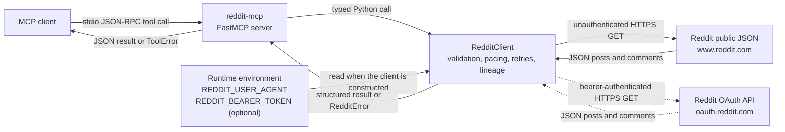

# System context

`reddit-mcp` exposes read-only Reddit research tools to an MCP client. The
server delegates Reddit behavior to one client, which owns validation, request
pacing, retries, response normalization, and source lineage.

The OAuth path is used only when `REDDIT_BEARER_TOKEN` is present. Both paths
are read-only. `UrllibTransport` performs HTTP I/O, while the MCP wrapper maps
expected `RedditError` failures to MCP `ToolError` responses.
